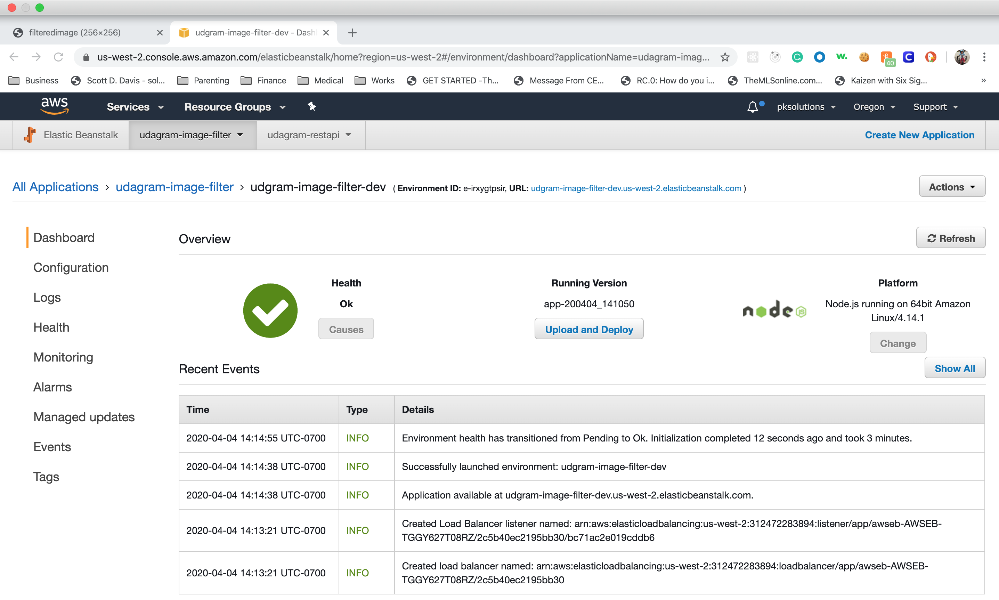

## Image Filter API
This is simple api that take image url from query string and return the resized image. Clean up all images from local storage after done processing.

### How to run
1.  Image url: https://1.bp.blogspot.com/-1uQRYMklACU/ToQ6aL-5uUI/AAAAAAAAAgQ/9_u0922cL14/s1600/cute-puppy-dog-wallpapers.jpg
2.  Endpoint url: http://udgram-image-filter-dev.us-west-2.elasticbeanstalk.com/filteredimage?image_url=

http://udgram-image-filter-dev.us-west-2.elasticbeanstalk.com/filteredimage?image_url=https://1.bp.blogspot.com/-1uQRYMklACU/ToQ6aL-5uUI/AAAAAAAAAgQ/9_u0922cL14/s1600/cute-puppy-dog-wallpapers.jpg

### Screen shots

#### Deployment

#### Successful call from api on browser

#### Successful call from api on postman

#### Failed call from api due to invalid url.
